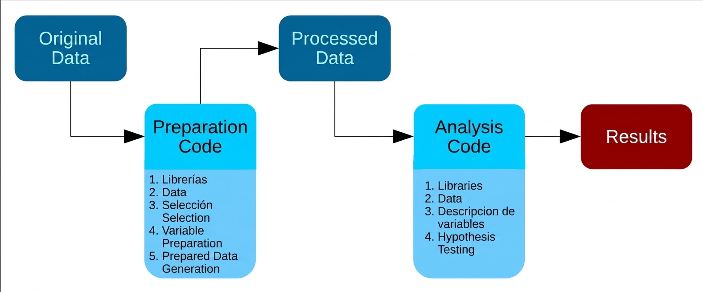
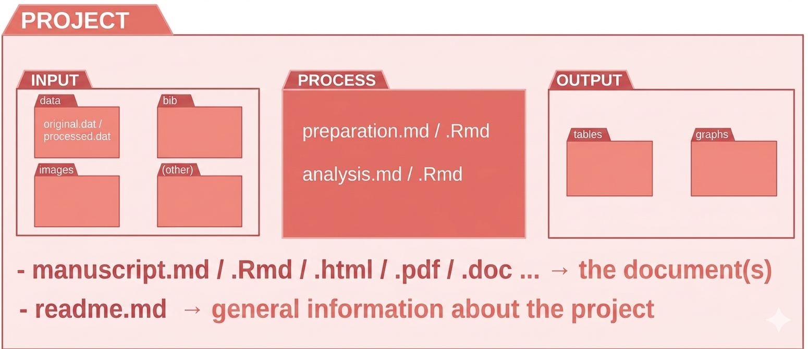

## Built on Prior Work

::: {.callout-note icon="true"}
based on the TIER protocol (Teaching Integrity in Empirical Research). TIER “promotes the integration of principles and practices related to transparency and replicability in the research training of social scientists.” More information: https://www.projecttier.org/.
:::

- **Self-contained**
- **Organized in structured folders** (data, code, outputs, etc.)
- **Our take:** ideally (not necessarily) using open-source software and open formats to maximize accessibility and reproducibility.
- **Can be shared and aims to be executed by other researchers**
- Always open to improvements and adaptations to specific research contexts and needs.
          
## The IPO protocol [^2]

{width="100%"}

[^2]: Own translation based on Castillo (2020) at the LISA Lab from COES. See [IPO Protocol](https://lisa-coes.github.io/ipo/index.html) for more details. 

## The folder structure

{width="100%" align="center"}

## The root/ 

The **root folder** contains the main files of the project and it is organized in a hierarchical structure. 

- **README file**: description of the project, instructions for using the files, and contact information.

- **Main document** (e.g., "paper.docx", paper.qmd): main document outlining the research findings and conclusions.

- **`input/`**: data files needed for the analysis.

- **`processing/`**: scripts and programs used for processing the data. 

- **`output/`**: results of the analysis, including tables, figures, and reports.

## (1) /input

- **Raw data and processed data** used for the analysis
- Organized in clear and consistent manner
- Descriptive names indicating content and format
- Examples: "issp_data_2020.dta", "df_study1.RData"
- Subfolders for different data types (e.g., "original/", "proc/")
  
::: {.callout-tip icon="true"}
## 💡 Note
Be aware that depending on the data sources (e.g. surveys) won't be able to share the raw data due to ethical and legal issues. In this case, you can share the processed data (e.g., "df_study1.RData") and provide detailed information about the data processing steps in the "Processing/" folder.
:::


## (2) /processing

- **Scripts and programs** used for data processing and analysis
- Well-documented with comments explaining each step and assumptions
- Examples: "proc_preparation.R", "proc_analysis.R"
- Ensures project structure is clear and reproducible for other researchers

::: {.callout-note icon="true"}
## 🔦 Connection to Input/Output
Connected to input as it uses data from the "Input/" folder and generates results for the "Output/" folder.
:::

## (3) /output
- **Results of the analysis**: tables, figures, and reports
- **Organized subfolders**: "tables/", "images/"
- **Descriptive naming**: indicates content and format
- Examples: "table1.csv", "table2.txt", "figure1.png"
- **Accessible and interpretable** for other researchers

::: {.callout-tip icon="true"}
## 💡 Note
Use clear, descriptive filenames and organize outputs by type (tables, figures) for easy navigation. Consider including a README in this folder describing each output file's purpose and how to interpret it.
:::

## Folder Structure

::: {style="font-size: 1.0em; line-height: 1.5;"}
```
Project/ (Root Folder) 
├── input/                      # External information and raw materials
│   ├── data/                   # Data-specific storage
│   │   ├── original/           # Raw data files & metadata (read-only)
│   │   └── proc/               # Cleaned/Processed data files
│   ├── images/                 # Image assets for the document
│   ├── bib/                    # Bibliography and citation files (.bib)
│   └── prereg/                 # Study pre-registration documents
│
├── processing/                 # Code and scripts folder
│   ├── preparation.Rmd         # Script for data cleaning/wrangling
│   └── analysis.Rmd            # Script for statistical models/analysis
│
├── output/                     # Results generated by the code
│   ├── images/                 # Figures, plots, and visual results
│   └── tables/                 # Formatted data tables and summaries
│
├── README.md                   # General project description & instructions
└── main_document.qmd                   # Main research document (source)
    ├── main_document.pdf               # Compiled output document
    ├── main_document.html              # Web-ready output document
    └── main_document.docx              # Word version for collaboration
```
:::
