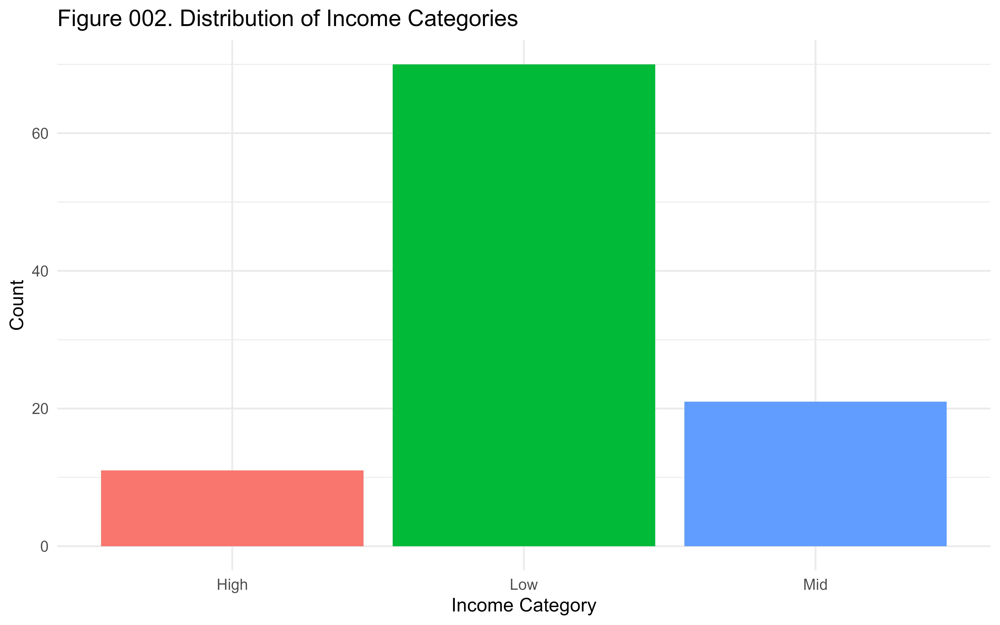

```{r, include=FALSE}
knitr::opts_chunk$set(fig.retina = 2, dpi = 300)
```

# Markdown Basics 

## Why Markdown in Academic Work?

- Plain text is durable, transparent, and version-control friendly.
- Quarto uses Pandoc Markdown, which supports rich academic features.
- One source can render to slides, HTML, PDF, and Word.
- Focus on ideas first, formatting second.

## Core Principle

Markdown should stay readable even before rendering.

> "A Markdown-formatted document should be publishable as-is, as plain text..."

For academic writing, this means your manuscript remains legible during drafting, review, and collaboration.

## Minimal Manuscript Skeleton

::: columns

::: {.column width="40%"}
```markdown
# Title of the Study

## Introduction
## Theory and Hypotheses
## Data and Methods
## Results
## Discussion
## References
```
:::

::: {.column width="60%"}
```{=html}
<h3>Title of the Study</h3>
<h5>Introduction</h5>
<h5>Theory and Hypotheses</h5>
<h5>Data and Methods</h5>
<h5>Results</h5>
<h5>Discussion</h5>
<h5>References</h5>
```
:::

:::

Use headings to communicate argument structure.

## Text Formatting for Scholarly Prose

::: columns

::: {.column width="40%"}
```markdown
*italics* for emphasis or terms
**bold** for limited emphasis
***bold italics*** sparingly
H~2~O for subscript
x^2^ for superscript
`inline code` for variables/functions
```
:::

::: {.column width="60%"}
*italics* for emphasis or terms

**bold** for limited emphasis

***bold italics*** sparingly

H~2~O for subscript

x^2^ for superscript

`inline code` for variables/functions
:::

:::

Keep emphasis minimal and intentional.

## Lists for Research Logic

::: columns

::: {.column width="40%"}
```markdown
Research workflow:

1. Define research question
2. Prepare data
3. Estimate models
4. Report findings

- Main finding
	- Robustness check
```
:::

::: {.column width="60%"}
Research workflow:

1. Define research question
2. Prepare data
3. Estimate models
4. Report findings

- Main finding
	- Robustness check
:::

:::

Leave a blank line before lists so they render correctly in Quarto.

## Links and Figures in Papers

::: columns

::: {.column width="40%"}
```markdown
[Replication repository](https://osf.io/)



[Figure note](#figure-note)
```
:::

::: {.column width="60%"}
[Replication repository](https://osf.io/)

{width="10%" fig-align="center"}

[Figure note](#figure-note)
:::

:::

Use informative captions and meaningful alt text when possible.

## Footnotes for Clarifications

::: columns

::: {.column width="40%"}
```markdown
This claim uses an alternative coding rule.[^rule]

[^rule]: Results are robust to a three-category coding scheme.

Inline note example.^[Useful for short clarifications in drafts.]
```
:::

::: {.column width="60%"}
This claim uses an alternative coding rule.[^rule]

[^rule]: Results are robust to a three-category coding scheme.

Inline note example.^[Useful for short clarifications in drafts.]
:::

:::

Footnote IDs must be unique in the full document.

## Tables in Pipe Syntax

::: columns

::: {.column width="40%"}
```markdown
| Variable   | Mean | SD   | N   |
|-----------:|:-----|:----:|----:|
| Prestige   | 46.8 | 14.2 | 102 |
| Income     | 6798 | 4245 | 102 |
```
:::

::: {.column width="60%"}
| Variable   | Mean | SD   | N   |
|-----------:|:-----|:----:|----:|
| Prestige   | 46.8 | 14.2 | 102 |
| Income     | 6798 | 4245 | 102 |
:::

:::

Alignment markers (`:---`, `---:`, `:---:`) improve readability.

## Equations for Formal Statements

::: columns

::: {.column width="40%"}
```markdown
Inline math: $E(Y|X)=\beta_0+\beta_1X$

Display math:
$$
Y_i = \beta_0 + \beta_1 X_i + \varepsilon_i
$$
```
:::

::: {.column width="60%"}
Inline math: $E(Y|X)=\beta_0+\beta_1X$

Display math:

$$
Y_i = \beta_0 + \beta_1 X_i + \varepsilon_i
$$
:::

:::

Use inline math for brief notation and display math for core models.

## Code Blocks for Reproducibility

````markdown
```{r}
#| echo: true
#| warning: false
model <- lm(prestige ~ income + education, data = dfstudy1)
summary(model)
```
````

Show code when teaching methods; hide code when presenting only final results.

## Common Pitfalls in Academic Drafts

- Skipping blank lines before lists or blocks.
- Overusing bold, colors, or decorative formatting.
- Inconsistent heading levels.
- Non-unique footnote identifiers.
- Large uncaptioned tables/figures.

## Practical Checklist

Before submitting a draft:

1. Confirm heading hierarchy reflects argument flow.
2. Confirm all tables and figures are labeled and interpretable.
3. Confirm equations render correctly.
4. Confirm links, footnotes, and citations are valid.
5. Render to PDF/HTML and review formatting differences.

Source guide: <https://quarto.org/docs/authoring/markdown-basics.html>