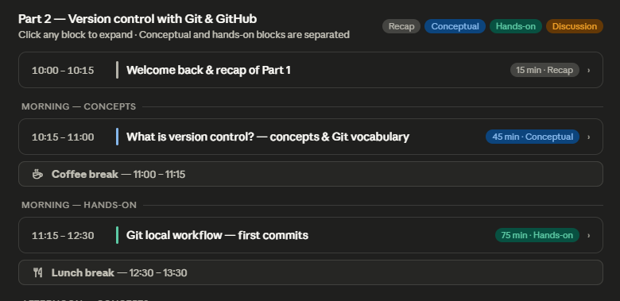
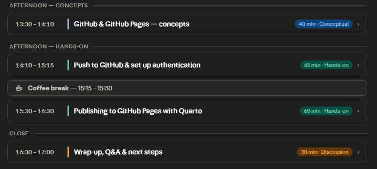
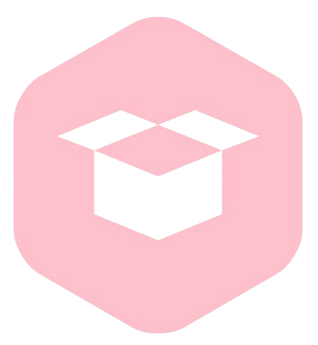

## 

{width="70%" fig-align="center"} 

## 

{width="70%" fig-align="center"}

## Materials

{width="40%" fig-align="center"}

## Background and motivation

- **Open** Social Science Lab (LISA for Laboratorio de Ciencia Social Abierta)
- Founded in 2019 at the Centre for Social Conflict and Cohesion Studies, COES (2013-2025)
- Development of a minimal framework for Open ***Social*** Science *from* and *for* the Latin American  social sciences.
 
{width="50%" fig-align="center"}

## How does an open social science look like?

::: {.callout-note appearance="minimal" icon="true"}

🔍 **Motivation**

Principles, procedures and tools to make research more transparent, reproducible, and accessible to specialized and non-specialized audiences.

:::

::: {.columns width="100%"}

::: {.column width="25%"}
::: {.fragment fragment-index=1}
### Transparency {align="center"}
{width="90%"}
:::
:::

::: {.column width="25%"}
::: {.fragment fragment-index=2}
### Openness {align="center"}
{width="90%"}
:::
:::

::: {.column width="25%"}
::: {.fragment fragment-index=3}
### Reproducibility {align="center"}
{width="90%"}
:::
:::

::: {.column width="25%"}
::: {.fragment fragment-index=4}
### Access {align="center"}
{width="90%"}
:::
:::

:::

## The open science workflow [^1]

{width="100%"}

[^1]: Own translation based on Castillo (2020) at the LISA Lab from COES. See [IPO Protocol](https://lisa-coes.github.io/ipo/index.html) for more details.   

 