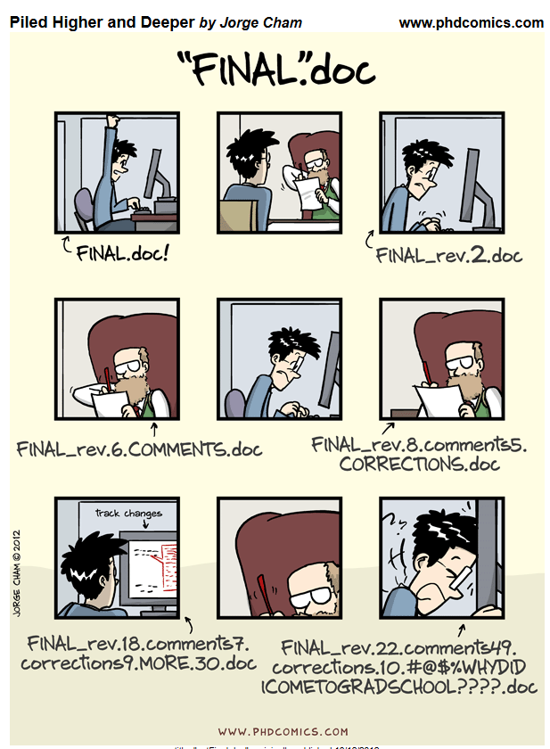
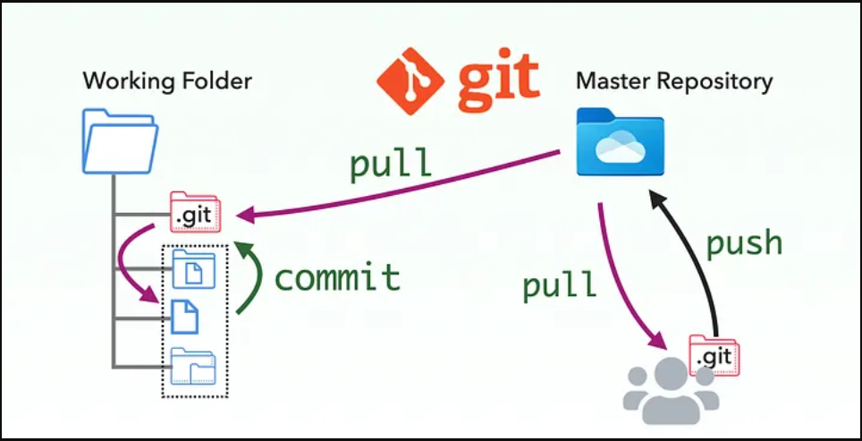

# Version control {background-color="#f8f9fa"}

## Where we left off

In Part 1 we built a **self-contained, reproducible project**:

```
bigsss-study/
├── input/
├── processing/
├── output/
├── README.md
└── main_document.qmd   ← renders to HTML
```

. . .

Today we add one more layer:

> **Making every decision in that project traceable, reversible, and shareable.**

---

## 

{width="75%"}

## The problem we all recognise

:::{.r-stack}

```
paper.docx
paper_v2.docx
paper_v2_FINAL.docx
paper_v2_FINAL_revised.docx
paper_v2_FINAL_revised_JI_comments.docx
paper_v2_FINAL_FINAL.docx
paper_v2_FINAL_FINAL_submitted.docx
```

:::

. . .

* Which one is the real final? What changed between them?  
* Who made that change, and why?
* Basically: a headache for you and your future self 

---

## The same problem in code

```r
# analysis.R           ← what did this one do?
# analysis_v2.R
# analysis_backup.R
# analysis_new.R
# analysis_working.R   ← is this the one?
# analysis_OLD.R
```

. . .

* Multiply this across a team, over two years, on a shared drive.
* Then add collaborators, reviewers, and the public — all asking for the "final" version. 
* Result: a **black box** that no one can open without breaking it.

---

## A better mental model

Think of version control as a **permanent, annotated undo history** — but one that:

<br>

- Goes back as far as the project itself
- Stores *who* made each change and *why*
- Works across an entire folder, not just one file
- Can be shared with collaborators and the scientific community


---

## Why this matters for open science

In Part 1 we talked about **transparency** and **reproducibility**.

. . .

Version control is what makes them *operational*:

| Without version control | With version control |
|------------------------|---------------------|
| "We changed the recoding at some point" | Commit: *"Recoded income into 3 categories (Low/Mid/High)"* |
| "I think this was the model we submitted" | Every version of every script is recoverable |
| "Trust me, the data was clean" | Every processing step is documented and dated |

. . .

> Version control is the **provenance layer** of a research project.

---

## Git ?

:::: {.columns}

::: {.column width="48%"}

{width="100%"}

Linus Torvalds created **Git** in 2005 to manage the development of the Linux kernel.
:::

::: {.column width="48%"}


Today, Git is the **de facto standard** for version control in software development — and increasingly in research.

Git is a **command-line tool** that runs on your computer.  
You can use it through a terminal or through graphical interfaces (like RStudio's Git pane).

In this workshop, we will use Git through RStudio's built-in terminal and Git pane — no need to install or configure a separate application.
:::

::::

## Git ?



# Core vocabulary {background-color="#f8f9fa"}

*Five concepts you need before opening the terminal*


## 1. Commit

A **commit** is a snapshot of your entire project at a specific moment in time.

. . .

Each commit has:

- A **unique ID** (a long hash like `a3f9c12`)
- A **message** describing what changed
- A **timestamp** and **author**
- A link back to the previous commit

. . .

```
a3f9c12  "Add descriptive table to output/"         ← newest
d8e1b04  "Recode income variable into 3 categories"
7c2a091  "Initial project structure"                 ← oldest
```

---

## What makes a good commit message?

:::: {.columns}

::: {.column width="48%"}
**❌ Not useful**

```
fix
changes
update
asdfgh
final version
more stuff
```
:::

::: {.column width="48%"}
**✅ Useful**

```
Add regression table (model 1–4)
Fix recoding of blue_collar dummy
Remove raw data from output/
Update README with folder structure
Render main_document to HTML
```
:::

::::

. . .

> Rule of thumb: finish the sentence *"If applied, this commit will…"*

---

## 2. Repository

A **repository** (or *repo*) is your project folder plus its full commit history.

```
bigsss-study/          ← your files, as always
└── .git/              ← Git's hidden folder — the entire history lives here
    ├── commits
    ├── branches
    └── config
```

. . .

- You never edit `.git/` directly
- Deleting `.git/` removes the history but leaves your files intact
- The repo is fully **self-contained** — the history travels with the folder

---

## 3. The staging area

Between editing a file and committing it, there is a **staging area** — a waiting room where you choose exactly what goes into the next commit.

. . .

:::: {.columns}

::: {.column width="32%"}
**Working directory**  
Files you are editing
:::

::: {.column width="32%"}
**Staging area**  
Changes you have selected for the next commit
:::

::: {.column width="32%"}
**Repository**  
Committed snapshots
:::

::::

. . .

Think of it like a **shopping cart**: you browse the store (working directory), add selected items to the cart (staging), then check out (commit).

. . .

This lets you commit only part of your changes — useful when you have fixed two different things in one session.

---

## 4. Branch

A **branch** is a parallel timeline in the same repository.

<!-- ```
main    ──●──●──●──●──●──────────────────●  (published version)
                    \                   /
feature              ●──●──●──●──●──●    (experimental analysis)
``` -->

{width="75%"}

. . .

Branches let you:

- Try something risky without breaking the main version
- Work on two papers in the same repo simultaneously
- Collaborate without overwriting each other

. . .

::: {.callout-note}
We won't practice branching hands-on today — but knowing the concept matters for understanding GitHub's interface.
:::

---

## 5. Remote

A **remote** is a copy of your repository stored somewhere else — usually a server on the internet.

```
Your laptop          GitHub server
bigsss-repo/    ←→  github.com/phd-bigsss/bigsss-repo
(local repo)         (remote repo)
```

. . .

The remote serves two purposes:

- **Backup** — your history is safe even if your laptop breaks
- **Sharing** — collaborators and reviewers can access the exact same project

. . .

The remote is usually named **`origin`** by convention.

---

## Up next — hands-on

After the coffee break we will:

1. Check Git is installed (`git --version`)
2. Configure your name and email (one time only)
3. Initialize a repo inside `bigsss-study/`
4. Make your first two commits
5. Write a `.gitignore` for R projects

. . .

> Everything will happen inside **RStudio** — the Git pane and the built-in Terminal tab.  
> No need to find or configure a separate terminal application.

---

## Where we are heading

After this session you will push your project to:

<br>

```
github.com/phd-bigsss/bigsss-repo
          ↓
phd-bigsss.github.io/bigsss-repo   ← live website
```

<br>

That is the topic of **Part 3 — GitHub**.

# Coffee break  {background-color="#b10f2a"} 

# Hands-on exercise {background-color="#f8f9fa"}

*Initialize a repo, make commits, and explore the history*

---

## Exercise — step by step

**1. Initialize the repo**

```bash
cd path/to/bigsss-study
git init
git status
```

. . .

**2. Create a README**

```bash
echo "# bigsss-study" > README.md
```

---

## Exercise — stage and commit

**3. Stage files**

```bash
git add README.md    # stage one specific file
git add .            # or stage everything at once
```

. . .

**4. Commit**

```bash
git commit -m "Initial project structure and README"
```

. . .

**5. Check status again**

```bash
git status
```

---

## Exercise — inspect the history

**6. View the commit log**

```bash
git log
git log --oneline
git log --oneline --graph
```

. . .

`--oneline` gives a compact one-line-per-commit view.  
`--graph` adds a visual branch/merge diagram — useful once you have more history.

---

## Exercise — roll back (if needed)

**7. Three levels of undo**

```bash
# A — unstage a file (before committing)
git restore --staged README.md

# B — undo the last commit, keep changes in working directory
git reset --soft HEAD~1

# C — undo a commit that was already pushed (safe for shared history)
git revert HEAD
```

. . .

::: {.callout-warning}
`git reset --hard HEAD~1` discards all changes permanently — use with caution.
:::

---

## References and further reading

- Bryan, J. (2024). *Happy Git and GitHub for the useR*. <https://happygitwithr.com>
- Chacon, S. & Straub, B. (2014). *Pro Git* (free). <https://git-scm.com/book>
- Quarto publish documentation. <https://quarto.org/docs/publishing/github-pages.html>

