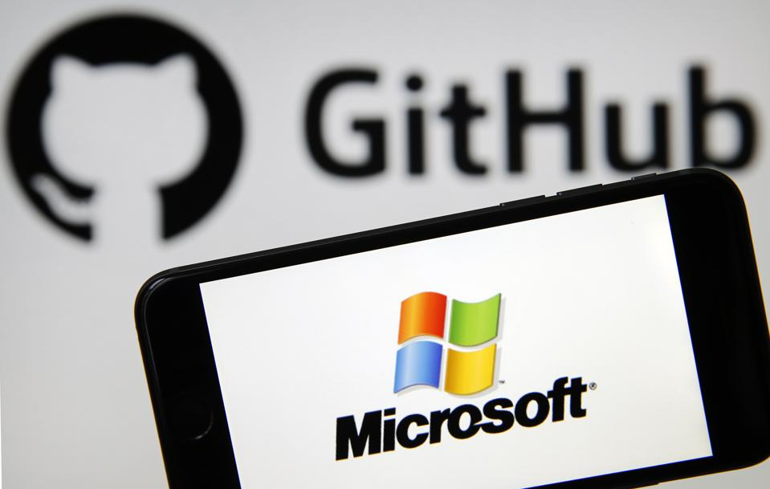
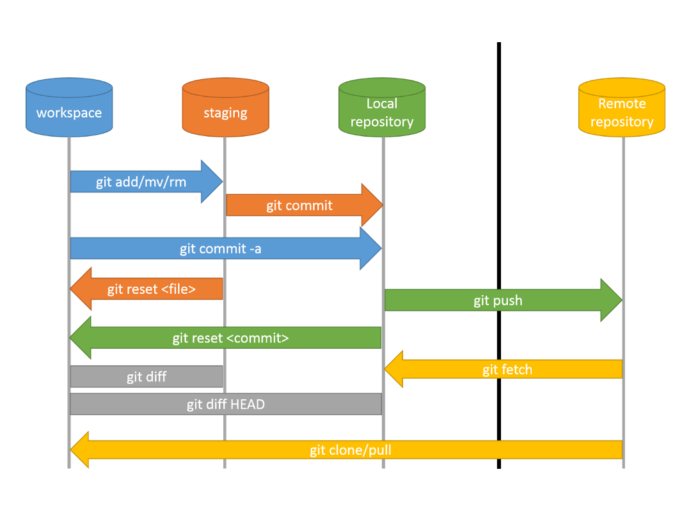
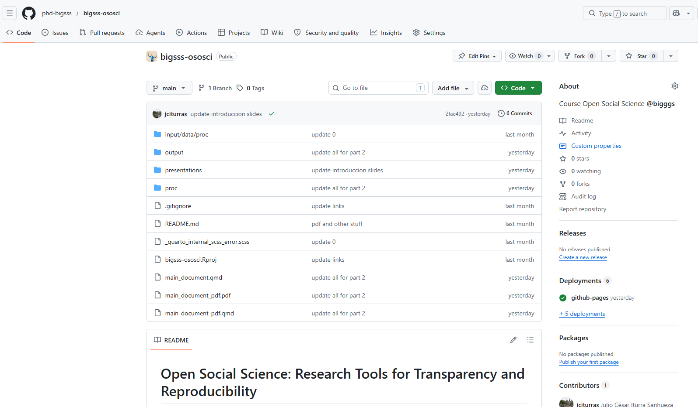
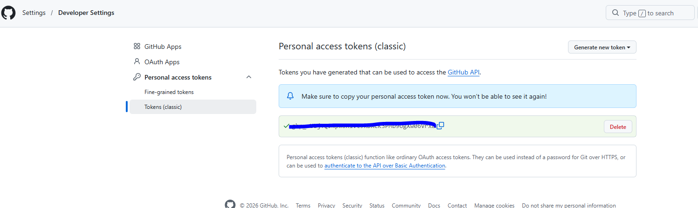

# Repositories and GitHub {background-color="#aa0000"}

## So far today

We have a local Git repository with a commit history:

```
a3f9c12  "Add .gitignore for R project"
d8e1b04  "Add descriptive table to output/"
7c2a091  "Recode income variable into 3 categories"
1b8f305  "Initial project structure"
```

. . .

This history lives **only on your laptop**.

. . .

> What happens if your laptop breaks?  
> How does a collaborator access your project?  
> How does a reviewer reproduce your analysis?

# Git in context {background-color="#aa0000"}

*Where Git fits in the landscape*

---

## Git ≠ GitHub

This distinction trips up almost everyone at first.

<br>

| | What it is | Who makes it |
|---|---|---|
| **Git** | The version control *tool* — runs on your computer | Linus Torvalds / open source |
| **GitHub** | A *platform* that hosts Git repositories online | Microsoft |

. . .

<br>

You can use Git without GitHub (local-only history).  
GitHub requires Git to work.  
Other platforms exist: **GitLab**, **Bitbucket** — same Git underneath, different interface.

## Brief history of GitHub

:::: {.columns}

::: {.column width="55%"}
Founded in **2008** by Tom Preston-Werner, Chris Wanstrath, and PJ Hyett as a platform for hosting Git repositories online.

. . .

Quickly became the dominant platform for open-source software development.

. . .

In **2018** acquired by Microsoft for **$7.5 billion**.

. . .

Today, GitHub hosts over **100 million repositories** and is widely used in both industry and academia.
:::

::: {.column width="40%"}

. . .

{width="100%"}
:::

::::


## Why Git became the standard

Git was created in 2005 for the Linux kernel — one of the largest software projects in the world.

. . .

It won over alternatives (SVN, Mercurial, CVS) because it is:

- **Distributed** — every copy is a full backup, not just a thin client
- **Fast** — designed for hundreds of contributors making thousands of changes
- **Free and open source**

. . .

Today Git is used by essentially every software project — and increasingly by researchers doing computational social science.

---

## The full workflow

```
bigsss-repo/           1. git init / existing commits
      ↓
  (edit files)         2. git add / git commit
      ↓
github.com/phd-bigsss/bigsss-repo   3. git push
      ↓
phd-bigsss.github.io/bigsss-repo    4. publish with GitHub Pages
```

. . .

Each step builds on the last.  
At the end, editing a file and running two commands updates your live website.

---

## What GitHub adds

```
Your laptop                    GitHub server
─────────────────────          ─────────────────────────────
bigsss-study/                  github.com/phd-bigsss/bigsss-repo
├── .git/       ←──── push ──→  (full copy of your repo)
├── input/      ←──── pull ──←
├── output/
└── main_document.qmd
```

. . .

GitHub is a **hosting platform** for Git repositories. It stores a full copy of your repo — history and all — on a server you can reach from anywhere.

. . .

GitHub is not the only option: **GitLab** and **Bitbucket** work the same way.  
We use GitHub because it is the most widely used platform in research and science.

---


---

## A tour of the GitHub interface

When you open a repo on GitHub you see:

. . .

- **File browser** — all your files, rendered in the browser
- **Commit history** — every commit, clickable, showing exactly what changed
- **README** — your `README.md` rendered as a formatted page
- **Issues** — a discussion board for tasks, bugs, and feedback
- **Settings** — where you configure GitHub Pages (coming soon)

. . .

::: {.callout-tip}
The rendered README is the first thing anyone sees when they visit your repo.  
A well-written README is worth the five minutes it takes.
:::

---


---

## Public vs. private repositories

:::: {.columns}

::: {.column width="48%"}
**Public**

- Anyone can view and clone
- Required for GitHub Pages (free tier)
- Expected norm in open social science
- Your OSF preregistration can link directly to it
:::

::: {.column width="48%"}
**Private**

- Only you (and invited collaborators) can see it
- Useful during active writing before publication
- Can be made public later
- Still backed up and version-controlled
:::

::::

. . .

> A common workflow: develop privately, make public at submission or publication.  
> Today we use a **public** repo so GitHub Pages works without extra configuration.

# Remote workflow vocabulary {background-color="#f8f9fa"}

*Four operations you will use every day*

---

## remote

A **remote** is a named link between your local repo and a server.

```bash
git remote add origin https://github.com/phd-bigsss/bigsss-repo.git
```

. . .

- The name `origin` is a convention — it refers to the main remote
- A repo can have multiple remotes (rare in practice for individual researchers)
- Think of it as saving a contact: you give GitHub's address a short name

. . .

```bash
git remote -v     # check what remote is currently set
```

```
origin  https://github.com/phd-bigsss/bigsss-repo.git (fetch)
origin  https://github.com/phd-bigsss/bigsss-repo.git (push)
```

---

## push

**Push** sends your local commits to the remote.

```bash
git push origin main
```

. . .

- `origin` — which remote to send to
- `main` — which branch to push

. . .

After the first push you can use the shorthand:

```bash
git push
```

. . .

::: {.callout-note}
Git will only push commits that the remote does not already have.  
It never overwrites history — it only adds to it.
:::

---

## pull

**Pull** brings commits from the remote into your local repo.

```bash
git pull
```

. . .

You use `pull` when:

- You worked on a different machine and need to sync
- A collaborator pushed new commits and you want them locally
- You edited a file directly on GitHub and need those changes locally

. . .

> **Good habit:** always `git pull` before you start working on a project,  
> and always `git push` before you close it.

---

## clone

**Clone** downloads a complete copy of a remote repo — history and all — to a new machine.

```bash
git clone https://github.com/phd-bigsss/bigsss-repo.git
```

. . .

This is how you would:

- Set up your project on a new laptop
- Give a collaborator access to your repo
- Download a published dataset or replication package

. . .

::: {.callout-tip}
In RStudio: **File → New Project → Version Control → Git → paste URL**.  
This runs `git clone` for you and opens the project immediately.
:::

---

## The four operations together

```
─── Local ────────────────────────────────── Remote ───

  Edit files
      ↓
  git add / git commit   (build local history)
      ↓
  git push          ──────────────────→   GitHub
                                              ↓
  git pull          ←──────────────────   (changes from
                                          collaborators
                                          or other machines)
```

---

## Authentication — the key concept

Before you can push, GitHub needs to know you are who you say you are.

. . .

GitHub no longer accepts your account password over HTTPS.  
Instead, it requires a **Personal Access Token (PAT)** — a long random string that acts as a password, but scoped only to Git operations.

. . .

Two authentication methods exist:

| Method | What it is | Recommended for |
|---|---|---|
| **HTTPS + PAT** | A token stored on your machine | Most users — simpler setup |
| **SSH key** | A cryptographic key pair | Advanced users comfortable with the terminal |

---

## Authentication — the classic git approach

**Step 1 — Create a token on GitHub:**

> GitHub → Settings → Developer settings → Personal access tokens → Tokens (classic) → *Generate new token* 

* Select scope: `repo` (full control of private repositories)  
* Copy the token immediately — GitHub will not show it again.

https://github.com/settings/tokens:  

{width=800px}


---

**Step 2 — Tell Git to remember your credentials:**

```bash
git config --global credential.helper store
```

This tells Git to save credentials to a plain file on disk after the first use.

. . .

**Step 3 — On your first `git push`, Git will prompt:**

```
Username: phdstudent
Password: ghp_xxxxxxxxxxxxxxxxxxxx   ← paste your PAT here (not your GitHub password)
```

After this, Git reuses the stored token automatically.

---

## Authentication — the R way

The two R packages `usethis` and `gitcreds` automate what you just did manually.

. . .

**`usethis`** is a general-purpose R package for development workflows (projects, GitHub, packages).  
`usethis::create_github_token()` opens the GitHub token page in your browser **with the right scopes already selected** — no need to navigate the settings manually.

. . .

**`gitcreds`** is an R package that reads and writes credentials using your **operating system's secure credential store** (Keychain on macOS, Windows Credential Manager, the system keyring on Linux) — safer than plain-text storage.

. . .

```r
usethis::create_github_token()   # browser opens → create token → copy it
gitcreds::set_gitcreds()         # prompts for the token → stores it securely
```

. . .

::: {.callout-important}
You do this **once per machine**. After that, `git push` and `git pull` just work — from the terminal or from RStudio.
:::

---

## Authentication — the R way (step by step)

**1. Install the packages**

```r
install.packages(c("usethis", "gitcreds"))
```

. . .

**2. Create the token**

```r
usethis::create_github_token()
```

Browser opens → give the token a name (e.g. `"my-laptop"`) → set expiration → click **Generate token** → copy the `ghp_...` string. GitHub will never show it again.

. . .

**3. Store the token**

```r
gitcreds::set_gitcreds()
# → Enter password or token: ghp_xxxxxxxxxxxx
```

. . .

**4. Verify**

```r
gitcreds::gitcreds_get()   # should show your username and a masked token
```

---

## Collaboration — a brief look ahead

Today we are working **individually**. But the same tools support collaboration:

. . .

- **Fork** — your own copy of someone else's repo, linked back to the original
- **Pull request** — a proposal to merge your changes into another repo (or branch)
- **Issues** — a structured way to report problems or request features

. . .

These are the building blocks of how open-source software is built —  
and increasingly how collaborative research is coordinated.

. . .

::: {.callout-note}
Branching, pull requests, and collaborative workflows are material for a future session.  
Today the goal is: **your repo, your history, on GitHub**.
:::

---

## Vocabulary recap

| Term | One-line definition |
|------|---------------------|
| **Remote** | A named link to a copy of your repo on a server |
| **origin** | The conventional name for your main remote |
| **push** | Send local commits to the remote |
| **pull** | Bring remote commits to your local repo |
| **clone** | Download a complete repo from a remote |
| **PAT** | A token GitHub uses to verify your identity |

---

## Up next — hands-on

We will now set up authentication and push your local repo to GitHub:

1. Generate a PAT with `usethis::create_github_token()`
2. Store it with `gitcreds::set_gitcreds()`
3. Create an empty repo on GitHub
4. Connect it to your local repo with `git remote add origin <url>`
5. Push with `git push -u origin main`
6. Improve your README and push again

. . .

> After this block, your project will be live on GitHub.  
> Then we move to making it a **website**.

---

## References

- Bryan, J. (2024). *Happy Git and GitHub for the useR*. <https://happygitwithr.com>
- GitHub Docs — Getting started. <https://docs.github.com/en/get-started>
- `usethis` package documentation. <https://usethis.r-lib.org>
